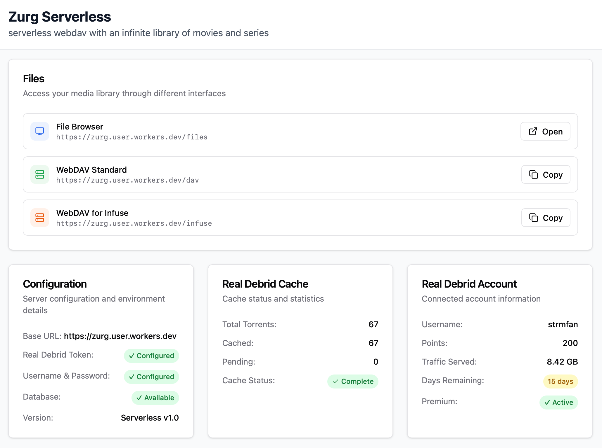

# Zurg Serverless

Share your Real Debrid library through a serverless WebDAV endpoint, using .STRM file-based streaming, running as a Cloudflare Worker.

[](https://deploy.workers.cloudflare.com/?url=https://github.com/andesco/zurg-serverless)



## Features

### Dual Interface
- **File Browser**: web interface for browsing your media library
- **WebDAV endpoints**: compatible with media players, optimized for Infuse

### Smart Streaming and Caching System
- **.strm files**: each .strm file contains a permanent short link (e.g., `/strm/ABCD1234WXYZ5678`) which redirects to an up-to-date Real Debrid download link
- **intelligent caching**: download links are requested on demand and cached for 7-days
- error fallback: .STRM redirects to an error video when media is unavailable.
- hourly cache update: processes up to 100 uncached torrents in about 10 minutes, updated once an hour or on-demand

### Serverless Architecture
- **Cloudflare Workers**: Global edge computing
- **Cloudflare D1**: Distributed SQLite database

## Deployment

### Recommended Deployment
[](https://deploy.workers.cloudflare.com/?url=https://github.com/andesco/zurg-serverless)

After deployment, add your secrets manually.

1. [Cloudflare Dashboard](https://dash.cloudflare.com/) ⇢ Workers & Pages ⇢ Zurg Serverless ⇢ Settings
2. Under **Variables and Secrets**, add the following secrets: \
   `RD_TOKEN` https://real-debrid.com/apitoken \
   `USERNAME` \
   `PASSWORD`
3. Deploy.

### Command Line Deployment

```bash
git clone https://github.com/andesco/zurg-serverless
cd zurg-serverless
npm install
wrangler login
npm run deploy-local
wrangler secret put RD_TOKEN
wrangler secret put USERNAME
wrangler secret put PASSWORD
```

## Usage

| Interface | URL | Purpose |
|-----------|-----|---------|
| **File Browser** | `https://your-worker.workers.dev/` | web interface |
| **WebDAV** | `https://your-worker.workers.dev/dav` | standard endpoint|
| **WebDAV for Infuse** | `https://your-worker.workers.dev/infuse` | optimized endpoint |

## How Caching Works

### Smart Caching Strategy
- **Root Browse**: Fetches torrent list + details for 5 newest torrents (proactive)
- **Individual Access**: Fetches torrent details on-demand when browsed
- **STRM Generation**: Creates download links when .strm files are accessed
- **Hourly Cron**: Processes up to 100 uncached torrents with 20-second delays

### Cache Lifecycle
1. **Torrent List**: Updated every 15 seconds, identifies new additions
2. **File Details**: Cached for 7 days, refreshed when accessed
3. **Download Links**: Cached for 7 days, regenerated when expired
4. **Background Processing**: Hourly job fills remaining cache gaps

### API Rate Limiting
- **Conservative batching**: 5 torrents per batch with 20+ second delays
- **Respects Real-Debrid limits**: ~14 calls/minute (well under 20/minute limit)
- **Fallback handling**: Broken files use `/not_found.mp4` placeholder

## Configuration

### Required Secrets
```bash
wrangler secret put RD_TOKEN        # your Real Debrid API token
wrangler secret put USERNAME        # optional: basic auth. username
wrangler secret put PASSWORD        # optional: basic auth. password
```

### Environment Variables
| Variable | Default | Description |
|----------|---------|-------------|
| `REFRESH_INTERVAL_SECONDS` | `15` | Torrent sync frequency |
| `TORRENTS_PAGE_SIZE` | `1000` | Real-Debrid API page size |
| `API_TIMEOUT_SECONDS` | `30` | Request timeout |

## Development

```bash
npm run dev                 # local development
npm run deploy-staging      # deploy to staging
npm run deploy-local        # deploy to production
```

The project uses both:
- a `wrangler.toml` template to support [Deploy to Cloudflare](https://developers.cloudflare.com/workers/platform/deploy-buttons/); and
- a `wrangler.local.toml` for development & command-line deployment.

### Project Structure
```
src/
├── worker.ts           # Main Worker entry point
├── realdebrid.ts       # Rate-limited Real-Debrid client
├── storage.ts          # D1 database operations
├── strm-handler.ts     # STRM URL resolution with fallback
├── security.ts         # WebDAV-safe security headers
├── webdav-handlers.ts  # WebDAV protocol handling
├── html-browser.ts     # HTML interface
└── types.ts            # TypeScript definitions
```

### Troubleshooting

**Empty directory listings:**
- verify Real-Debrid token is valid: `wrangler secret list`
- check logs: `wrangler tail`

### Update Error Video

The error video was generated using [FFmpeg](https://ffmpeg.org):

```bash not_found.mp4
read -p "error message to display via streaming video:" error_message \
  && error_message=${error_message:-media file not found}
ffmpeg -f lavfi -i color=c=black:s=1920x1080:d=10 \
  -vf "drawtext=fontfile=/path/to/font.ttf:text='${error_message}':fontsize=96:fontcolor=white:x=(w-text_w)/2:y=(h-text_h)/2" \
  -c:v libx264 -t 10 -pix_fmt yuv420p -movflags +faststart not_found.mp4
  ```